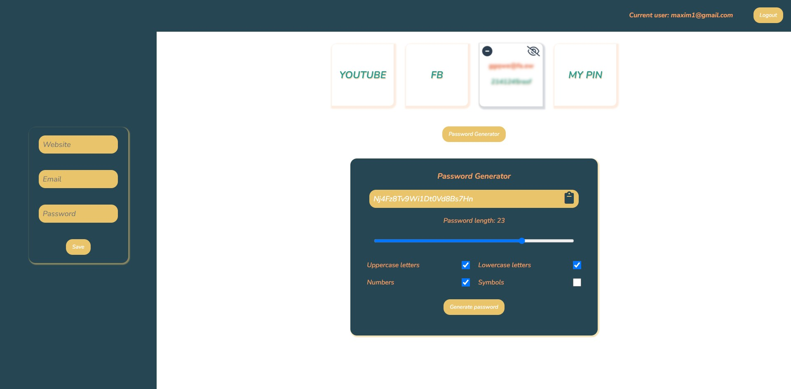
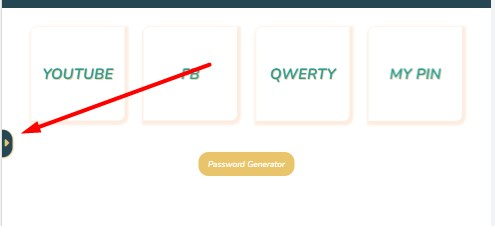
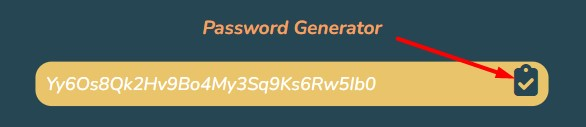
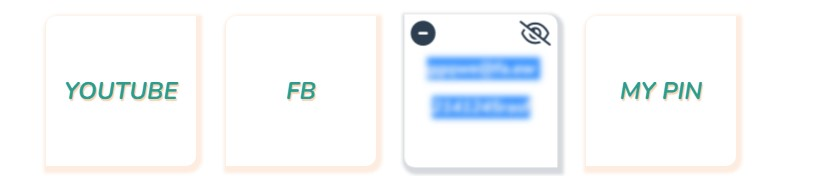

# Password Keeper & Password Generator



## 📋 Project Description

Hi, there! 👋
If you have at least one of those problems you are more than welcomed to use my APP:

- You are not the only person who is using a PC or a laptop;
- You don't want to keep your passwords in your browser's settings, because anyone can see them;
- You have difficulties to creating STRONG passwords for websites;
- You don't want to use the same password on all websites;
- Even if you are able to create STRONG passwords, you keep forgetting them;

💻 This project was created via:

- Vue 3 Composition API;
- Firebase for backend;
- Font Awesome Icons;

## Small implementations which might increase your User Experience or you can use some of ideas in your projects ☺️

0️⃣ When the screen is 800px or less the left bar is hidden but when is needed you can always just pull.



1️⃣ You don't need to select whole password to copy it just press on a clipboard and when it's ticked it means you already copied your password to buffer;



2️⃣ If the card with your password is blurred you can't copy it via selecting and pressing CTRL + C / CMND + C. To be able to copy your email and pass, please, press on the eye icon in the right top corner of the card;



## 🆓 Emails and passwords for tests

If you don't want to sign in new account you can always use one of those:

- Email: maxim1@gmail.com / Password: maxim1
- Email: lisa01@gmail.com / Password: lisa01

🙏 If you use them, please don't make a mess and don't delete all passwords

I hope you enjoy using it. If you have any problems or ideas feel free to contact me via:

📱 [Telegram](https://t.me/lizabulkina2111)
📧 [Gmail](efremovmaxim95@gmail.com)

## 🚀 Project setup

```
# install dependencies
npm install

# serve with hot reload at localhost:8080
npm run serve
```

### Compiles and minifies for production

```
npm run build
```

### Customize configuration

See [Configuration Reference](https://cli.vuejs.org/config/).
